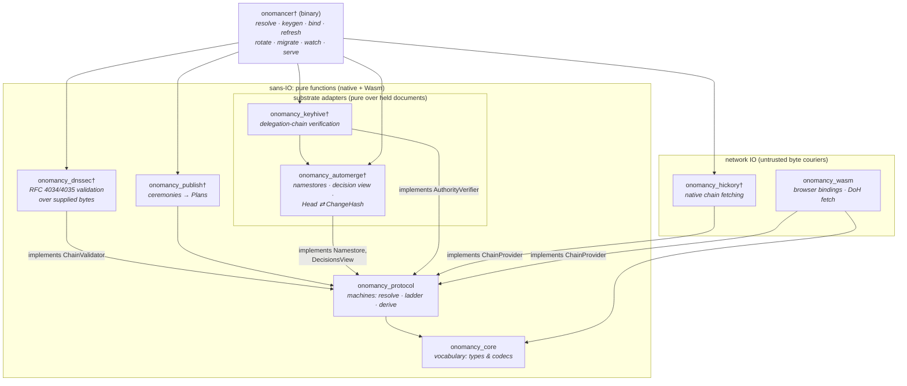

# Onomancy

A local-first _edgename_ protocol: human-meaningful names over self-certifying keys, with optional DNSSEC-rooted global names layered on top.

This repository contains:
- protocol specifications
- design rationale
- `onomancer` (the reference implementation)

| Name                    | Anchor        | Authority                                                                 | Shareable |
|-------------------------|---------------|---------------------------------------------------------------------------|-----------|
| `automerge:3RFyJz…/foo` | doc anchor    | an Automerge URL; the doc ID is an ed25519 verifying key, self-certifying | yes       |
| `~/bob/pics`            | local petname | your signed root doc                                                      | no        |
| `@expede.wtf/foo`       | DNSSEC-rooted | chain from the IANA root KSK                                              | yes       |

All three name forms resolve to an [Automerge](https://automerge.org) document whose ID is an ed25519 verifying key (via [Keyhive](https://github.com/inkandswitch/keyhive)) — a self-certifying identity, and the root that resolution starts from. Petnames and DNS names are naming layers over those documents, so an account created offline already has a globally shareable name, and binding a domain later adds a memorable spelling for the _same_ identity. No migration, ever.

DNS-rooted names verify locally, from a baked-in [IANA] [root KSK] through a [DNSSEC]-protected [TXT record] to a signed certificate fetched from a designated endpoint (or received by gossip). Verified bindings are self-authenticating records: they can be gossiped peer-to-peer (Bluetooth at a field campout, QR codes) and re-verified by the receiver with no trust in the sender.

> [!WARNING]
>
> Early development. Nothing here is stable, audited, or ready for real world use.

## Design

See [`specs/`](./specs/README.md) for the normative protocol specifications (path resolution, DNS anchoring, petname anchoring, serialization), and [`design/`](./design/README.md) for informal deep dives into why the design is how it is.

## Workspace

| Crate                                  | Purpose                                                                              |
|----------------------------------------|--------------------------------------------------------------------------------------|
| [`onomancy_core`](./onomancy_core)   | `no_std`-leaning vocabulary: name grammar, TXT codec, certificate & statement units  |
| [`onomancy_protocol`](./onomancy_protocol) | Sans-IO machines: resolution walk, comparison ladder, binding-cache derivation       |
| [`onomancy_wasm`](./onomancy_wasm)   | Wasm/JavaScript bindings for browsers and Node.js                                    |

Libraries implement the protocol (`onomancy_*`); agents that practice it are onomancers (`onomancer_*`).



† planned — the crate layout follows the role stack (verifier / publisher over one pure core), not client/server: every participant is a verifier and servers are keyless byte couriers. Everything outside the network boundary is pure: cryptographic verification (DNSSEC chains, Keyhive delegation proofs) runs over supplied bytes against locally-held trust anchors, and document reads (namestores, decision state) run over locally-held replicas — statements carry their authority proofs verbatim and resolution never blocks on sync, so gossip is enough. The substrate adapters differ from the algorithm crates only in what they depend on (Automerge/Keyhive library types), not in purity; replication and persistence belong to the substrate and the agent, never to these crates.

## Development

With [Nix](https://nixos.org) (flakes enabled):

```sh
nix develop   # rust 1.91, wasm toolchain, cargo-* utilities, command menu
menu          # list dev-shell commands (rust:*, wasm:*)
```

Or bring your own toolchain pinned by [`rust-toolchain.toml`](./rust-toolchain.toml):

```sh
cargo test --workspace --all-features
cargo clippy --workspace --all-features --all-targets
```

## License

Licensed under either of

- Apache License, Version 2.0 ([LICENSE-APACHE](./LICENSE-APACHE) or <http://www.apache.org/licenses/LICENSE-2.0>)
- MIT license ([LICENSE-MIT](./LICENSE-MIT) or <http://opensource.org/licenses/MIT>)

at your option.

### Contribution

Unless you explicitly state otherwise, any contribution intentionally submitted for inclusion in the work by you, as defined in the Apache-2.0 license, shall be dual licensed as above, without any additional terms or conditions.

<!-- External Links -->

[DNSSEC]: https://www.rfc-editor.org/rfc/rfc4033
[IANA]: https://www.iana.org/
[TXT record]: https://www.rfc-editor.org/rfc/rfc1035#section-3.3.14
[root KSK]: https://www.iana.org/dnssec
