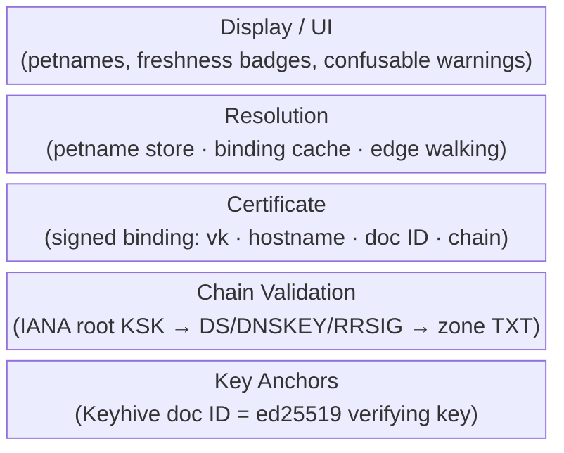

# Onomancer Design

This directory contains design documents for Onomancer, a local-first edgename system with self-certifying keys as ground truth and optional DNSSEC-rooted global names layered on top.

Original design sketch: <https://gist.github.com/expede/be95825f9e32b8ec926860d29965a184>

## Documents

| Document                          | Purpose                                                |
|-----------------------------------|--------------------------------------------------------|
| [`assumptions`](./assumptions.md) | Environmental assumptions and invariants               |
| [`names`](./names.md)             | The three-anchor name grammar                          |
| [`anchors`](./anchors.md)         | Trust model: key anchors as ground truth               |
| [`dns-binding`](./dns-binding.md) | DNSSEC TXT binding record and chain validation         |
| [`certificate`](./certificate.md) | The Onomancer certificate and `/.well-known/onomancy`  |
| [`resolution`](./resolution.md)   | Petname store, binding cache, and resolution semantics |
| [`security`](./security.md)       | Threat model and accepted risks                        |

## Name Anatomy

```
~/bob/pics          local petname   — your signed root doc, not shareable
@expede.wtf/foo     DNSSEC-rooted   — chain from IANA KSK, shareable
@z6MkhaXg…/foo      key anchor      — doc ID = ed25519 vk, self-certifying
└┬┘ └───┬───┘ └┬┘
sigil  anchor  path segments (edges, one doc hop per segment)
```

## Trust Layers



Every layer above the key anchor is a _naming layer_: petnames and DNS names both resolve to key anchors, which are the only source of authority. See [`anchors.md`](./anchors.md).

## Typical Flow

```mermaid
sequenceDiagram
    participant O as Owner (expede.wtf)
    participant D as DNS Zone
    participant S as Onomancer Server
    participant C as Client
    participant P as Offline Peer

    Note over O,S: 1. Publish
    O->>D: TXT "v=1;k=ed25519;p=<doc ID>" (DNSSEC-signed)
    O->>S: install signed Onomancer certificate

    Note over C,S: 2. Resolve @expede.wtf/foo
    C->>S: GET /.well-known/onomancy
    S->>C: certificate { vk, hostname, doc ID, ts, sig, DNSSEC chain }
    Note over C: validate chain from baked-in IANA KSK<br/>TXT pubkey must equal cert vk
    Note over C: cache self-authenticating binding<br/>walk /foo edges from root doc

    Note over C,P: 3. Gossip (e.g. Bluetooth at DWeb Camp)
    C->>P: certificate (record-first: cert + chain)
    Note over P: re-verifies from OWN baked-in KSK<br/>no trust in C required
```

## Design Principles

- _Keys are ground truth_ — petnames and DNS names are naming layers over self-certifying key anchors; no identity migration when a domain is bound later
- _Parse, don't validate_ — the trust anchor is decided at parse time by an `Anchor` enum; ambiguous spellings are rejected, not resolved by precedence
- _Caches confer no authority_ — verified DNS bindings are self-authenticating records (cert + chain), re-verified at use from the baked-in KSK; never edges in your root doc
- _Record-first sharing_ — gossip ships the certificate itself; receivers verify from their own trust anchor
- _No expiration_ — expiry is at odds with local-first; freshness is graded, not boolean, and revocation is a TXT key swap
- _Protocol-free names_ — shareable names carry no protocol info, versions, or sigils other than `@`
- _Local-first_ — offline introductions root as petnames and upgrade to chain-rooted when a certificate arrives
