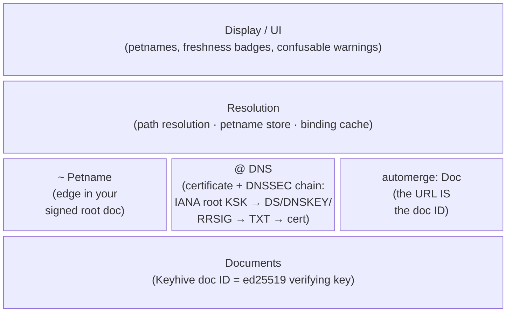
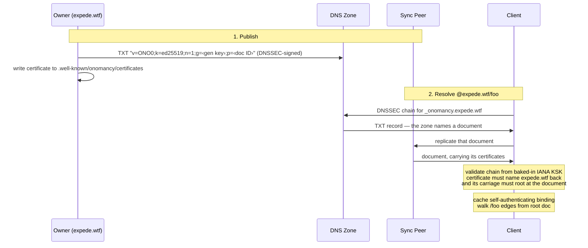
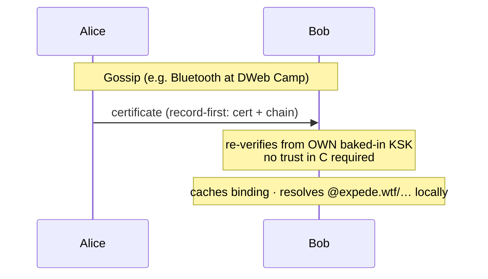

# Onomancy Design

This directory contains design documents for Onomancy, a local-first edgename protocol with self-certifying keys as ground truth and optional DNSSEC-rooted global names layered on top.

## Motivation

Global names could be rooted in pure DNS, but the thing we actually want is shared commons infrastructure. DNS is one very light way to get that. It is also restrictive, unapproachable to normies, and comes with its own problems. So Onomancy asks as little of DNS as possible: a DNS-anchored name carries no protocol information (no schemes, no versions, no sigils beyond `@`), and everything that needs room to evolve — schema changes, bridges to other protocols like ATProto, which server answers for a name — lives in the [certificate layer](./certificate.md). How resolution works under the hood is deliberately left open to encourage experimentation. The DNS binding is the stable, minimal trust root; it is not the protocol.

## Documents

| Document                          | Purpose                                                |
|-----------------------------------|--------------------------------------------------------|
| [`assumptions`](./assumptions.md) | Environmental assumptions and invariants               |
| [`names`](./names.md)             | The three-anchor name grammar                          |
| [`anchors`](./anchors.md)         | Trust model: documents as ground truth               |
| [`dns-binding`](./dns-binding.md) | DNSSEC TXT binding record and chain validation         |
| [`certificate`](./certificate.md) | The Onomancy certificate and its lookup endpoint       |
| [`resolution`](./resolution.md)   | Petname store, binding cache, and resolution semantics |
| [`security`](./security.md)       | Threat model and accepted risks                        |
| [`verification`](./verification.md) | Lean 4 model, theorems, and conformance-vector pipeline |
| [`keyhive-coordination`](./keyhive-coordination.md) | Upstream asks blocking `onomancy_keyhive` (the last stubbed seam) |
| [`limitations`](./limitations.md)   | What Onomancy does NOT fix (phishing, custody, DNS politics, …) |
| [`comparisons/`](./comparisons/README.md) | How Onomancy relates to prior naming systems |

## Name Anatomy

```
sigil
↓
~/bob/pics             local petname   — your signed root doc, not shareable
 └───┬───┘
     path segments (namestore keys; one hop per matched key)

sigil
↓
@expede.wtf/foo        DNSSEC-rooted   — chain from IANA KSK, shareable
 └───┬────┘└┬─┘
   anchor   path segments

automerge:2nBeEM…/foo  doc anchor      — doc ID = ed25519 vk, self-certifying
└───┬────┘└──┬──┘└┬─┘
 scheme    doc ID  path segments
```

## Trust Layers



The middle layer is _anchoring_: three families, each with its own trust machinery, all converging on the same ground truth. The certificate and DNSSEC chain validation are internals of the DNS family, not universal layers — petnames and doc anchors never touch them. Every anchor resolves to a document (a self-certifying document ID), which is the only source of authority. See [`anchors.md`](./anchors.md).

## Fetch Flow

First resolution of a DNS-anchored name: the owner publishes in two places — the zone says which document, the document says which hostnames it accepts — and the client checks both directions locally. Neither half suffices alone: anyone controlling any signed zone can name any document, so it is the certificate coming back the other way that makes the pair a binding.



## Gossip Flow

The binding is a self-authenticating record, so it travels without its origin: a peer with no DNS access verifies it from their own trust anchor. After the first fetch, resolution never queries the network again — this is the record-first property.



## Design Principles

| Principle                  | Meaning                                                                                                                                                                  |
|----------------------------|--------------------------------------------------------------------------------------------------------------------------------------------------------------------------|
| Keys are ground truth      | Petnames and DNS names are naming layers over self-certifying document IDs; no identity migration when a domain is bound later                                           |
| Parse, don't validate      | Parsing returns structured types with their invariants already established (a normalized `DnsName`, a checked `DocAnchor`) — no string name exists downstream of the parser, so nothing re-validates |
| Anchors are parse-time facts | Each spelling family is exactly one anchor kind; ambiguous spellings are rejected, never resolved by precedence or connectivity                                          |
| Caches confer no authority | Verified DNS bindings are self-authenticating records (cert + chain), re-verified at use from the baked-in KSK; never edges in your root doc                             |
| Record-first sharing       | Gossip ships the certificate itself; receivers verify from their own trust anchor                                                                                        |
| No expiration              | Expiry is at odds with local-first; freshness is graded, not boolean, and revocation is a delegation revocation inside the doc (TXT changes only for document migration) |
| Protocol-free DNS names    | DNS anchors carry no protocol info; doc anchors are full Automerge URLs by design, converging with the ecosystem rather than abstracting over it               |
| Local-first                | Offline introductions root as petnames and upgrade to chain-rooted when a certificate arrives                                                                            |
| Hints carry no authority   | Endpoints, mirrors, and sync peers are transport hints — they affect whether you get the bytes, never whether the bytes verify; there is no canonical location for a record, and address records on the name itself have no protocol role at all |
