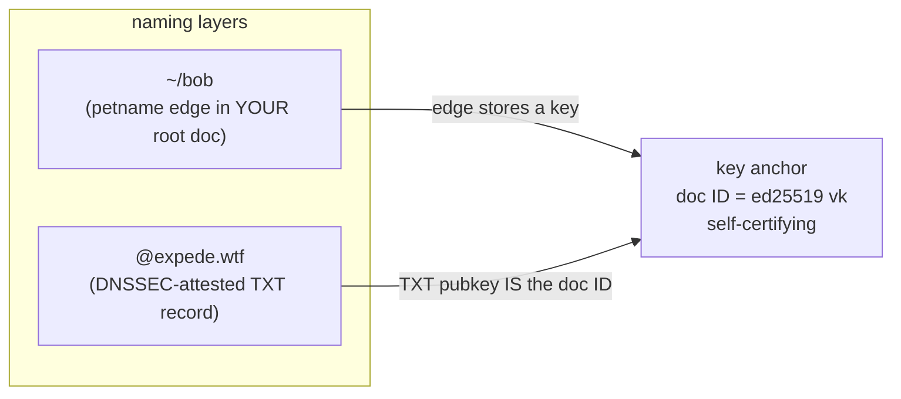

# Trust Anchors

Key anchors are ground truth. The other two anchors — petnames and DNS names — are _naming layers_ that resolve to key anchors. This document explains why, and what falls out of it.

## Key Anchors Are Ground Truth

With Keyhive enabled, an Automerge root document ID _is_ an ed25519 verifying key: a self-certifying identity. Both naming layers bottom out there:



> [!WARNING]
> The claim that a Keyhive doc ID is the _controlling authority_ of its document (and that rotation preserves it) is an unverified assumption — see [assumptions.md](./assumptions.md#keyhive--automerge).

## Consequence 1: DNS Bindings Are Not Edges in Your Root Doc

Installing a verified DNS binding as an edge in your own signed root document would _launder DNS's authority into yours_:

- Your published root would attest `expede.wtf → K` under _your_ signature — an attestation you have no basis to make.
- Local malware could forge "verified" edges indistinguishable from real ones.
- Upstream key rotation would go stale silently, pinned under your signature.

Instead, verified bindings live in a _binding cache_ of self-authenticating certificates (cert + DNSSEC chain), re-verifiable by anyone from the baked-in IANA KSK. Presence in the cache confers nothing; the chain is the authority, checked at use. See [resolution.md](./resolution.md#binding-cache).

## Consequence 2: Petnames Hold Keys, Never Borrowed Authority

Petname edges store verifying keys (plus met-as metadata for humans). Trust never flows through a name, so upstream key rotation flows through automatically and cycles terminate structurally ([resolution.md](./resolution.md#termination)).

## Consequence 3: Gossip Is Record-First

Sharing a verified DNS binding means shipping the certificate itself. The receiver re-verifies the chain from their _own_ baked-in KSK — the sender's authority never enters the picture. This is what makes Bluetooth-at-DWeb-Camp style propagation safe among mutually untrusting peers.

## Consequence 4: No Identity Migration

An account created offline already has a globally shareable name: its doc ID (`@z6Mk…`). Binding a domain later adds a _memorable spelling for the same identity_ — nothing moves, nothing re-keys, no forwarding records.

```
day 0 (offline):   @z6MkhaXg…/blog          works forever
day 30 (bind DNS): @expede.wtf/blog         same doc, same key
```

## Zooko's Triangle, Three Ways

| Anchor | Secure | Global | Memorable |
|-----------|--------|--------|-----------|
| Key | ✓ | ✓ | ✗ |
| DNS name | ✓* | ✓ | ✓ |
| Petname | ✓ | ✗ | ✓ |

\* modulo trust in DNSSEC and the IANA root KSK — see [security.md](./security.md#trust-anchor-compromise).

Rather than squatting one corner, Onomancer lets each name occupy the corner that fits, with key anchors as the common substrate.

## Revocation and Server Trust

The TXT record's pubkey is the root of each DNS binding. Swapping it revokes the previous binding — including a misbehaving onomancer server, which serves signed records it cannot forge. Resolution mechanics under the hood are deliberately open (server-signed records could bridge to ATProto etc.); the TXT key swap is the kill switch.
