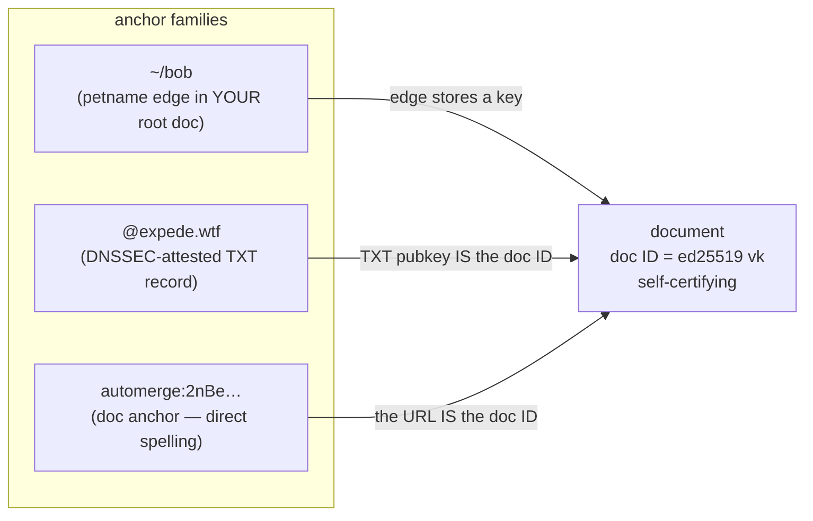

# Trust Anchors

Documents are ground truth. All three anchor families resolve to the same kind of referent — a document whose ID is a self-certifying key — and differ only in how they get there: petnames and DNS names are _naming layers_ over documents, while a doc anchor (the `automerge:…` spelling) names its document directly. This document explains why, and what falls out of it.

Terminology: _doc anchor_ is the spelling family; the _document_ (equivalently its _document ID_) is the referent every family converges on.

## Documents Are Ground Truth

A document ID _is_ an ed25519 verifying key (via Keyhive): a self-certifying identity. All three anchor families converge on it:



> [!NOTE]
> Verified: the doc ID is an ed25519 vk and is stable forever, but the root signing key is _destroyed at creation_ — the ID roots a self-certifying delegation graph rather than being a held key. Authority proofs are delegation chains; see [certificate.md](./certificate.md#fields) and [assumptions.md](./assumptions.md#keyhive--automerge).

## Consequence 1: DNS Bindings Are Not Edges in Your Root Doc

Installing a verified DNS binding as an edge in your own signed root document would _launder DNS's authority into yours_:

- Your published root would attest `expede.wtf → K` under _your_ signature — an attestation you have no basis to make.
- Local malware could forge "verified" edges indistinguishable from real ones.
- Upstream key rotation would go stale silently, pinned under your signature.

Instead, verified bindings live in a _binding cache_ of self-authenticating certificates (cert + DNSSEC chain), re-verifiable by anyone from the baked-in IANA KSK. Presence in the cache confers nothing; the chain is the authority, checked at use. See [resolution.md](./resolution.md#binding-cache).

## Consequence 2: Petnames Hold Keys, Never Borrowed Authority

Petname edges store bare document references (verifying keys); the alleged name from the introduction lives in the binding cache as an unverified claim, not on the edge. Trust never flows through a name, so upstream key rotation flows through automatically and cycles terminate structurally ([resolution.md](./resolution.md#termination)).

## Consequence 3: Gossip Is Record-First

Sharing a verified DNS binding means shipping the certificate itself. The receiver re-verifies the chain from their _own_ baked-in KSK — the sender's authority never enters the picture. This is what makes Bluetooth-at-DWeb-Camp style propagation safe among mutually untrusting peers.

## Consequence 4: No Identity Migration

An account created offline already has a globally shareable name: its doc ID (`automerge:2nBe…`). Binding a domain later adds a _memorable spelling for the same identity_ — nothing moves, nothing re-keys, no forwarding records.

```
day 0 (offline):   automerge:2nBeEMDj…/blog   works forever
day 30 (bind DNS): @expede.wtf/blog           same doc, same key
```

## Zooko's Triangle, Three Ways

| Anchor | Secure | Global | Memorable |
|-----------|--------|--------|-----------|
| Doc | ✓ | ✓ | ✗ |
| DNS name | ✓* | ✓ | ✓ |
| Petname | ✓ | ✗ | ✓ |

\* modulo trust in DNSSEC and the IANA root KSK — see [security.md](./security.md#trust-anchor-compromise).

Rather than squatting one corner, Onomancy lets each name occupy the corner that fits, with documents as the common substrate.

## Revocation and Server Trust

The TXT record's pubkey (= doc ID) roots each DNS binding, and the certificate's signing authority is a delegation from it — held by the **user** (a cold admin key), never by a server: onomancer servers are keyless couriers, so server compromise is denial-of-service only. Revocation happens _inside the document_: revoke a compromised device or admin key's delegation and its signatures fail verification — the TXT record never changes. Changing the TXT `p=` is reserved for genuine document migration (a new identity), which carries a signed successor statement so continuity is provable rather than asserted. Resolution mechanics under the hood are deliberately open (signed records could bridge to ATProto etc.); the delegation graph is the kill switch.

## The Mutual Backstop

The two shareable anchor families are each other's disaster recovery:

| Catastrophe | Rescue |
|-------------|--------|
| Lose the keys | The **name** rescues you: migrate `p=` to a fresh document — loud, surfaced, successor-less by necessity; contacts re-pin |
| Lose the name | The **keys** rescue you: identity, data, delegations, and every pinned edge survive; reclaim or replace the spelling |

Neither anchor alone is resilient; the pair is. The unrecoverable cases require losing both at once — which is why plural cold admin keys at creation and basic registrar hygiene are the two operational practices worth their cost ([security.md](./security.md#operational-guidance-for-publishers)).
