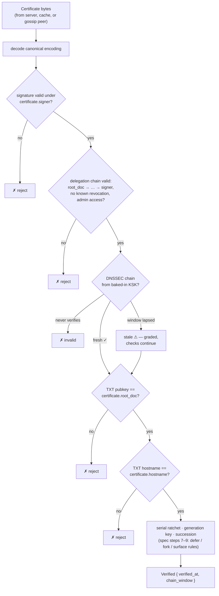

# Onomancy Certificate

The certificate is the self-authenticating record that binds a DNS hostname to a document. It is served over HTTP, cached, and gossiped — and verifiable by anyone holding the IANA root KSK, regardless of where the bytes came from.

## Retrieval

```
GET https://<endpoint host>/onomancy/v0/expede.wtf
```

The endpoint host comes from the SVCB/SRV hint at `_onomancy.<name>`, a mirror, or out-of-band knowledge — it is a transport hint, never an authority. The response is integrity-safe even over plain HTTP — the record proves itself — though the fetch is not private (see [security.md](./security.md#privacy)).

This endpoint is the default bootstrap, not a canonical location — whatever DNS makes it reachable is transport plumbing on the _target_ host, nothing more; the name's own address records play no role. Because the record is self-authenticating, any onomancy server can serve any name's certificate (aggregator/mirror endpoint shape is an open design point), and gossip needs no server at all. A server can withhold or serve stale records, never forge them; verifiers attach no meaning to which source supplied the bytes.

Fetch-based retrieval is deliberately HTTPS-and-static at v0: the certificate is an immutable blob, so "serve it" means a plain GET returning the bytes — nginx, a bucket, or a pages host suffices, and the server component reduces to a cert generator plus any static file server. Serving the certificate over document sync (from a public identity doc, riding the same connection as the documents themselves) is the intended warm path later, pending the public-readability design under Keyhive encryption — verification is source-agnostic, so adding that channel changes no trust semantics.

## Fields

The Keyhive doc-root signing key is destroyed at document creation (`EphemeralSigner`), so the certificate cannot be signed by the doc ID itself. Instead it is signed by a _delegated admin key_ — a **user-held** key, kept cold — and embeds the standard Keyhive authority proof: the `Signed<Delegation>` chain from the doc root down to the signer, verified exactly as Keyhive verifies it.

Admin access is required deliberately: a collaborator with mere Write access could otherwise bind _their_ hostname to _your_ document (insider key borrowing). And admin-only signing is cheap in practice — because the DNSSEC chain, the delegation chain, and the lineage are all attached unsigned, refresh and repair need no key at all, so the cold key surfaces only for genuine ceremonies: new bindings, migration, revocation. Servers never sign anything; they serve bytes.

The **generation key** the TXT attests must additionally lie on the signer's delegation path ([dns-binding.md](./dns-binding.md#generation-key)) — the chokepoint that makes revocation verifier-visible without a revocation list. The delegation chain itself is the deliberate price of an unheld doc root: even if a held root were possible, the prudent design would sign one delegation to a rotatable keyset and destroy the root — which is exactly what Keyhive does.

```rust
// Field order mirrors the wire layout: fixed-width first, then
// variable-width (specs/serialization.md).
pub struct Certificate {
    /// Root Automerge document ID — with Keyhive, an ed25519 vk.
    /// Must equal the pubkey in the zone's TXT record.
    root_doc: DocumentId,
    /// The delegated admin key that signed this certificate.
    signer: VerifyingKey,
    /// Claimed; sanity-checked against rough client clocks only.
    issued_at: Timestamp,
    /// The full DNS name this certificate binds (subdomains included).
    hostname: DnsName,
    /// Advisory: attested known-good heads at issuance. Never pins
    /// resolution — replayable certs would otherwise freeze state.
    heads: Option<Vec<ChangeHash>>,
    /// Continuity proof from a previously bound document: a successor
    /// statement signed by the predecessor's delegation graph. Absent
    /// on first bindings; required for a p= change to look routine.
    predecessor: Option<SuccessorStatement>,
    /// Signature by `signer` over the canonical encoding of all
    /// fields above. Everything below is the ATTACHED region:
    /// self-authenticating evidence, replaceable keylessly.
    signature: Signature,
    /// Keyhive authority proof: Signed<Delegation> chain from the
    /// doc root (self-certifying init) down to `signer`, passing through
    /// the TXT-attested generation key. Any valid chain for the same
    /// signer is interchangeable, so generation rotation is repaired
    /// by re-attaching — no re-signing.
    delegation_chain: Vec<Signed<Delegation>>,
    /// Generation lineage: each generation key signs over
    /// its predecessor, letting verifiers ratchet against g= rewinds.
    lineage: Vec<RotationStatement>,
    /// DNSSEC chain from the root KSK down to the zone's TXT record.
    chain: DnssecChain,
}
```

## Why the Attachments Are Unsigned

The signature covers _claims_; the attached region carries _evidence_ — and evidence authenticates itself:

```
signed   = what the signer asserts   (verifiable nowhere else; must be tamper-proof)
attached = what the world can check  (self-authenticating; own lifecycle; swap freely)
```

Each attached item is independently verifiable and cross-checked against fields that _are_ signed, so a signature over it would add zero integrity:

| Attached item      | Authenticated by                                          | Cross-checked against signed field          |
|--------------------|-----------------------------------------------------------|---------------------------------------------|
| `delegation_chain` | every hop is a `Signed<Delegation>`                       | terminates at `signer`, roots at `root_doc` |
| `lineage`          | rotation statements signed by keys on the doc's own chain | `root_doc`                                  |
| `chain` (DNSSEC)   | the verifier's **own** baked-in KSK                       | `hostname`, `root_doc` (via TXT `p=`)       |

An attacker who swaps attachments can only cause rejection or staleness, never a false bind. Signing them would actively hurt, three ways:

1. _Freshness coupling._ RRSIG windows lapse in days–weeks; a signed DNSSEC chain would drag the cold admin key out of storage for every routine refresh, instead of only for bindings, migration, and revocation. Keyless refresh is what makes admin-only signing operationally cheap.
2. _Rotation repair._ Any valid delegation chain from the doc root to the same `signer` is interchangeable proof, so after a generation rotation every _surviving_ signer's certificate is repaired by re-attaching a chain through the new generation key — by any keyless machine. Sign the chain and one revocation forces re-issuing every outstanding certificate with cold keys.
3. _Stale-evidence pinning._ Two certificates differing only in attached fields are the _same_ certificate carrying different evidence — which is how mirrors keep old signed bytes fresh. A signed chain freezes the evidence at issuance and makes fresher evidence unusable without the signer.

The contrast confirms the rule: `predecessor` sits **inside** the signature precisely because it is a claim an attacker must not strip or graft — a stripped successor proof would turn a routine migration into an apparent capture.

One residual is deliberate: an attacker can attach an _old but genuine_ delegation chain from before a revocation. Signing wouldn't help — they would replay the whole old certificate, old signature included — which is why that threat is answered by the [generation key](../specs/anchoring/dns-anchor.md#generation-key) check against the current TXT record, not by the encoding.

## Verification



The delegation-chain check is ordinary Keyhive verification: the first delegation is signed by the doc-root key itself (the self-certifying init), each subsequent hop by the previous delegate, terminating at `signer` with sufficient access. Two chains, one record: Keyhive proves _who may speak for the document_; DNSSEC proves _which document the domain designates_.

The output is graded (`fresh ✓ / stale ⚠ / invalid ✗`) per the chain window — see [dns-binding.md](./dns-binding.md#graded-freshness).

## Type-State: Unverified → Verified

Following the witness pattern, raw certificate bytes provide no access to their claims. The only path to the payload is through verification:

```rust
CertificateBytes ──decode──► Certificate ──try_verify(ksk, now)──► Verified<Certificate>
                              (claims inaccessible)                  (witness)
```

Code holding a `Verified<Certificate>` has compile-time proof that the chain was checked. An unverified chain and a verified binding are different types; forgetting to verify is a type error, not a bug class.

## Canonical Encoding

Signature security requires the encoding to be _injective_: two distinct certificates must never share encoded bytes (else they share a signature).

Decided: a custom binary codec in the subduction style — injective by construction rather than enforced against a general-purpose format, with no serde/CBOR in the signing path:

- Fixed field order
- Big-endian integers (no smallest-encoding ambiguity)
- Bijective varints for lengths (no overlong forms)
- Optional fields (`heads`) encoded unambiguously

Resolved: varints are [bijou64](https://github.com/inkandswitch/bijou/blob/main/bijou64/SPEC.md) via the [bijoux](https://crates.io/crates/bijoux) crate (subduction's encoding, since published standalone); the full byte layout, signature target, and chain framing live in the normative [serialization spec](../specs/serialization.md). Injectivity remains a formal-verification target.

## Distribution Is Record-First

The certificate is a _record_, not a session: it can be relayed by untrusted peers, mirrored, or carried on a phone to a field with no internet. Every receiver runs the same verification from their own baked-in KSK. This enables:

| Path | Example |
|------|---------|
| Direct fetch | `GET /onomancy/v0/<name>` at any serving host |
| P2P gossip | Bluetooth exchange at DWeb Camp |
| Cache | Local binding cache ([resolution.md](./resolution.md#binding-cache)) |

## Schema Evolution

The certificate layer is the deliberate extension point (the TXT record stays minimal):

- Signer compromise is handled inside Keyhive: revoke the delegation and issue a fresh certificate under another admin key — the doc ID (and thus the TXT record) never changes. A certificate whose signer has been revoked fails the delegation check on re-verification once the revocation is known.
- Signed records could bridge to other protocols (e.g. ATProto) without changing names — deliberately open, post-v0.
- Changing the TXT `p=` now means _document migration_ (a genuinely new identity), not key rotation — rotation happens in the delegation graph. Voluntary migration carries a `predecessor` successor statement so continuity is provable; a `p=` change without one is surfaced, never silent ([the dns-anchor spec's Succession section](../specs/anchoring/dns-anchor.md#succession)).
