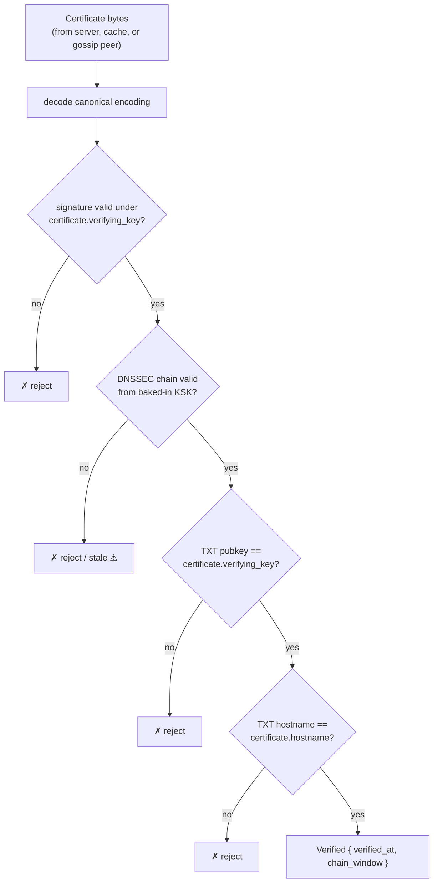

# Onomancer Certificate

The certificate is the self-authenticating record that binds a DNS hostname to a key anchor. It is served over HTTP, cached, and gossiped — and verifiable by anyone holding the IANA root KSK, regardless of where the bytes came from.

## Retrieval

```
GET https://expede.wtf/.well-known/onomancy
```

Per RFC 8615 (`/.well-known/`). The response is integrity-safe even over plain HTTP — the record proves itself — though the fetch is not private (see [security.md](./security.md#privacy)).

## Fields

```rust
pub struct Certificate {
    /// Must equal the pubkey in the zone's TXT record.
    verifying_key: VerifyingKey,
    /// The DNS hostname this certificate binds.
    hostname: DnsName,
    /// Root Automerge document ID — with Keyhive, this IS the
    /// verifying key above. Optionally pins heads.
    root_doc: DocumentId,
    heads: Option<Vec<ChangeHash>>,
    /// Claimed; sanity-checked against rough client clocks only.
    issued_at: Timestamp,
    /// Signature by `verifying_key` over the canonical encoding
    /// of all fields above.
    signature: Signature,
    /// DNSSEC chain from the root KSK down to the zone's TXT record.
    chain: DnssecChain,
}
```

## Verification



The output is graded (`fresh ✓ / stale ⚠ / invalid ✗`) per the chain window — see [dns-binding.md](./dns-binding.md#graded-freshness).

## Type-State: Unverified → Verified

Following the witness pattern, raw certificate bytes provide no access to their claims. The only path to the payload is through verification:

```rust
CertificateBytes ──decode──► Certificate ──try_verify(ksk, now)──► Verified<Certificate>
                              (claims inaccessible)                  (witness)
```

Code holding a `Verified<Certificate>` has compile-time proof that the chain was checked. An unverified chain and a verified binding are different types; forgetting to verify is a type error, not a bug class.

## Canonical Encoding

Signature security requires the encoding to be _injective_: two distinct certificates must never share encoded bytes (else they share a signature). Requirements mirror the usual canonical-codec rules:

- Fixed field order
- No overlong or variable representations of the same value
- Optional fields (`heads`) encoded unambiguously

Injectivity is a formal-verification target (tracked in TODO).

## Distribution Is Record-First

The certificate is a _record_, not a session: it can be relayed by untrusted peers, mirrored, or carried on a phone to a field with no internet. Every receiver runs the same verification from their own baked-in KSK. This enables:

| Path | Example |
|------|---------|
| Direct fetch | `GET /.well-known/onomancy` |
| P2P gossip | Bluetooth exchange at DWeb Camp |
| Cache | Local binding cache ([resolution.md](./resolution.md#binding-cache)) |

## Schema Evolution

The certificate layer is the deliberate extension point (the TXT record stays minimal):

- Room is reserved for a _successor-key statement_ — the key compromise story, pending Keyhive rotation semantics ([assumptions.md](./assumptions.md#keyhive--automerge)).
- Server-signed records could bridge to other protocols (e.g. ATProto) without changing names — deliberately open, post-v0.
- A misbehaving server is revoked by swapping the TXT key: the server serves records it cannot forge.
