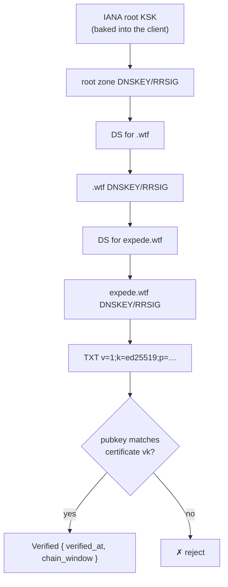

# DNS Binding

How a DNS name becomes a verified pointer to a key anchor: a DNSSEC-protected TXT record, validated from the baked-in IANA root KSK, corroborated by an [Onomancer certificate](./certificate.md) served over HTTP.

## Zone Setup

A participating zone publishes two things:

```zone
_onomancy.expede.wtf.  IN TXT  "v=1;k=ed25519;p=<base64 doc ID>"
expede.wtf.            IN A    203.0.113.7   ; or CNAME → onomancer server
```

> [!NOTE]
> The exact owner name for the TXT record (apex vs. `_onomancy` label) is an open codec detail; shown here with a service label per DNS convention.

## TXT Record Format

```
v=1;k=ed25519;p=<base64>
```

| Field | Meaning |
|-------|---------|
| `v` | Monotonic version — replay protection (see below) |
| `k` | Key algorithm; `ed25519` only at v0, leaves room for migration |
| `p` | The verifying key = Keyhive root doc ID ([anchors.md](./anchors.md)) |

### Monotonic Version Ratchet

Clients remember the highest version seen per name and reject lower ones. This prevents replay of superseded records (e.g. a revoked key's record served from a stale cache or a malicious resolver).

```
seen v=3  →  record v=2 arrives  →  reject (replay)
          →  record v=4 arrives  →  accept, ratchet to 4
```

> [!WARNING]
> A transient zone attacker can publish an absurdly high version, burning the ratchet even after the owner recovers the zone. Accepted risk; the escape hatch is a per-name manual "reset trust" action. See [security.md](./security.md#ratchet-poisoning).

### No Expiration

The record carries no expiry — expiration is at odds with local-first operation. Revocation is explicit: swap the key in the TXT record (and bump `v`). Freshness is graded at the chain layer instead.

## Chain Validation

Clients validate the full DNSSEC chain _locally_, from a baked-in copy of the IANA root KSK (exactly one at a time; it rotates every few years — a deliberately slow trust anchor):



Validation requirements (tracked in TODO):

- _Denial of existence_ — NSEC/NSEC3 processing, to distinguish "this zone has no binding" from a stripped-record downgrade attack.
- _CNAME and zone-cut coverage_ — the chain must cover every indirection, not just the final owner name.
- _Multiple TXT records_ — policy: highest version wins; overlap is expected during key rotation.
- _Hand-rolled vs. hickory's validator_ — undecided for native; the wasm path needs its own validation regardless.

## Graded Freshness

RRSIG windows are short (root ≈ 2 weeks; zones 1–30 days). Hard-rejecting expired chains would break offline gossip within weeks, so validation output is graded, not boolean:

```rust
pub struct Verified {
    pub verified_at: Timestamp,
    pub chain_window: Range<Timestamp>, // RRSIG inception..expiration
}
```

| Verdict | Meaning | Typical policy |
|---------|---------|----------------|
| fresh ✓ | chain window covers now | proceed |
| stale ⚠ | once-valid; window has lapsed | online: re-fetch · offline: warn and proceed |
| invalid ✗ | never verified from the KSK | reject |

Explicit trust statement: verification proves the binding was DNS-rooted _during its window_. Staleness is a risk signal, not a forgery signal.

## The ChainProvider Seam

Fetching is abstracted behind a trait in `onomancer_core` (working name `ChainProvider`; final name TBD) because hickory does not run on wasm:

```rust
pub trait ChainProvider {
    type Error;

    /// Fetch the DNSSEC chain and TXT binding record for a hostname.
    /// Validation happens in core, NOT in the provider.
    async fn fetch_chain(
        &self,
        name: &DnsName,
    ) -> Result<RawChain, Self::Error>;
}
```

| Implementation | Crate | Mechanism |
|----------------|-------|-----------|
| Native | `onomancer_hickory` | hickory resolver |
| Browser | `onomancer_wasm` | DoH via `fetch()` |

The provider is an untrusted byte-fetcher: all verification runs in core against the baked-in KSK, so a malicious provider can cause denial of service but never a false `Verified`.

## KSK Rollover (Open)

Future work (tracked in TODO): a trust-anchor _set_ and an RFC 5011-style rollover story, so stale clients can validate chains signed under a newer KSK. At v0 a single 2024 IANA KSK is baked in.
