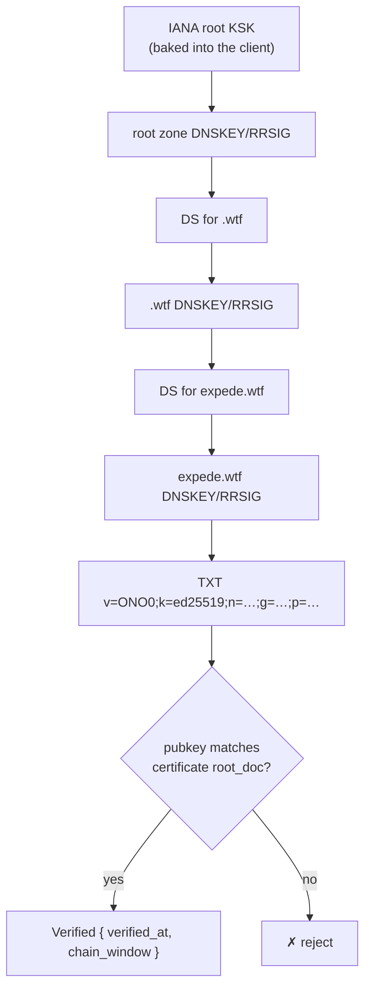

# DNS Binding

How a DNS name becomes a verified pointer to a document: a DNSSEC-protected TXT record, validated from the baked-in IANA root KSK, corroborated by an [Onomancy certificate](./certificate.md) carried inside the document it binds.

## Name Setup

The protocol requires exactly one record — the TXT binding. A second record designates a peer from which the bound document (and with it, the certificate it carries) can be replicated:

```zone
; The one required record:
_onomancy.expede.wtf.  IN TXT  "v=ONO0;k=ed25519;n=1;g=<base64 gen key>;p=<base64 doc ID>"

; RECOMMENDED: designate a sync peer that holds the bound document
; (any host — the publisher's own node, a mirror, a friend's):
_onomancy.expede.wtf.  IN SVCB 1 sync.example.

; With neither hint, the name is still fully conformant; the document
; travels by sync and gossip, it just isn't self-bootstrapping cold.
```

Only the TXT record anchors trust. The SVCB record is a **transport hint, not a canonical location**: it names a peer from which the bound document can be replicated — and with it the certificate the document carries — and nothing more. The binding has no home: any peer holding the document can supply it (mirrors, relays, a friend's node), gossip works with no peer at all, and verifiers attach no meaning to where the bytes came from. The analogy is a magnet link: the TXT `p=` is the infohash (all of the authority), the hints are trackers (none of it), and gossip is PEX. A lying hint can waste your time; it cannot change what verifies.

All onomancy DNS lives under the one `_onomancy.<name>` owner name — one DNSSEC coverage story, one denial-of-existence story, and no records on the name itself (the protocol never asks anyone to create or modify A records; a website on the same name is unrelated infrastructure).

> [!NOTE]
> Decided: the record lives at the `_onomancy` underscore service label (RFC 8552 convention) — it avoids apex TXT clutter (SPF, DMARC, site verification) and gives clean single-name NSEC/NSEC3 denial semantics.

The binding attaches to a _name_, not a zone: `@blog.expede.wtf` binds at `_onomancy.blog.expede.wtf` even when `blog.expede.wtf` is not its own zone. Distinct names carry distinct bindings (distinct identities), regardless of how they group into zones; chain validation covers whatever zone the owner name falls in.

## TXT Record Format

```
v=ONO0;k=ed25519;n=<serial>;g=<base64 generation key>;p=<base64 doc ID>
```

| Field | Meaning |
|-------|---------|
| `v` | Self-identifying format tag (`ONO0`), like `v=DKIM1` — changes only when the grammar changes; unknown `ONO` tags are skipped (dual-publish migration), foreign TXT records ignored |
| `k` | Key algorithm; `ed25519` only at v0, leaves room for migration |
| `n` | Serial — the monotonic anti-replay ratchet (see below) |
| `g` | The current generation key — the delegation-chain chokepoint certificate chains must pass through (see below) |
| `p` | The verifying key = Keyhive root doc ID ([anchors.md](./anchors.md)) |

Format version and ratchet are deliberately separate fields: publishers bump `n` freely on re-binding, so it cannot double as a grammar version — conflating them makes every format change a flag day.

### Serial Ratchet

Clients remember the highest serial seen per name; stale-chain records with lower serials are replays and are rejected. Publishers choose serials as `max(now_ms, last + 1)` — millisecond timestamps with a bump-on-collision fallback — which keeps them monotone, wall-clock-tracking, and multi-device-safe with no coordination.

```
seen n=3  →  stale record n=2          →  reject (replay)
          →  stale record n=4          →  accept, ratchet to 4
          →  fresh record n=1          →  accept, surface serial regression
          →  record n ≈ now + 20 min   →  defer, retry later
```

Two refinements defang ratchet poisoning: serials more than 5 minutes in the future are _deferred_ (not rejected — they ripen as the clock advances, so skew failures are transient delays), and records carried by _fresh_ chains may move the ratchet in either direction (within the skew bound — deferral precedes movement), surfaced as a ratchet-reset event. A transient attacker can therefore poison at most ~5 minutes ahead, and any fresh owner chain heals verifiers instantly. The clock stays advisory: this is a sanity bound, not a validity window — see [security.md](./security.md#ratchet-poisoning) for the offline residual.

### Generation Key

Revocation needs a record-visible signal, or a revoked admin with an old-but-genuine delegation chain keeps verifying until sync luck delivers the news. Rather than shipping revocation lists (negative facts can't travel in attacker-supplied records) or enumerating the authorized set (grant churn), the record attests one **chokepoint**: `g=` names a key that every certificate's delegation chain must pass through, at any depth — a solo user attests their admin key directly; an org interposes a dedicated generation key over its signers.

```
doc ──▶ admin ──▶ Gₙ ──▶ {alice, bob, carol}
                  └─ g= names this
```

Grants under the current generation are free (no DNS touch). Revocation rotates the generation: revoke `admin→Gₙ`, mint `Gₙ₊₁`, re-delegate survivors, publish the new `g=`. The revoked signer's chain routes through an unattested key and dies against any fresh chain — the verifier's check is positive path membership, no list, no sync. The one mandatory DNS touch is incentive-aligned: it lands during the revocation ceremony, when the publisher is already in DNS rotating credentials. It is the DS/KSK pattern one level up — and structurally similar to ATProto's rotation-key hierarchy, decentralized: zone-attested rather than directory-attested, no sequencer, no history rewrite. The zone+insider rewind and its generation-lineage defense are specified in [the dns-anchor spec](../specs/anchoring/dns-anchor.md#generation-key).

### No Expiration

The record carries no expiry — expiration is at odds with local-first operation. Revocation is explicit and layered: a compromised signer's generation is rotated out (`g=` changes; `p=` never does); changing `p=` (and bumping `n`) is reserved for document migration. Freshness is graded at the chain layer instead.

## Chain Validation

Clients validate the full DNSSEC chain _locally_, from a baked-in copy of the IANA root KSK (exactly one at a time; it rotates every few years — a deliberately slow trust anchor):



Validation requirements:

- _Denial of existence_ — outside the protocol at v0: negative proofs are never evaluated. A missing record is always "absence not proven" (possible downgrade, fails toward retention), and deliberate unbinding awaits a future owner-signed unbind statement — the statement-vouched mechanism, consistent with every other lifecycle event.
- _CNAME and zone-cut coverage_ — the chain must cover every indirection, not just the final owner name.
- _Multiple TXT records_ — policy: highest understood format tag, then highest serial `n`; overlap is expected during migration.
- _Wildcard synthesis_ — wildcard-derived TXT answers are REJECTED at v0: their no-closer-match proof would be a negative proof. Publishers MUST NOT rely on wildcard bindings.
- _Unknown algorithms are invalid, not insecure_ — a chain needing an unimplemented signature algorithm yields ✗; the resolver-world "treat as insecure" downgrade has no analogue for a KSK-rooted binding.
- _Hand-rolled vs. hickory's validator_ — undecided for the host path; the wasm path needs its own validation regardless.

## Graded Freshness

RRSIG windows are short (root ≈ 2 weeks; zones 1–30 days). Hard-rejecting expired chains would break offline gossip within weeks, so validation output is graded, not boolean:

```rust
pub struct Verified {
    pub verified_at: Timestamp,
    pub chain_window: Range<Timestamp>, // RRSIG inception..expiration
}
```

| Verdict   | Meaning                       | Typical policy                               |
|-----------|-------------------------------|----------------------------------------------|
| fresh ✓   | chain window covers now       | proceed                                      |
| stale ⚠   | once-valid; window has lapsed | online: re-fetch · offline: warn and proceed |
| invalid ✗ | never verified from the KSK   | reject                                       |

Explicit trust statement: verification proves the binding was DNS-rooted _during its window_. Staleness is a risk signal, not a forgery signal.

## The ChainProvider Seam

Fetching is abstracted behind a trait in `onomancy_core` (working name `ChainProvider`; final name TBD) because hickory does not run on wasm:

```rust
pub trait ChainProvider {
    type Error;

    /// Fetch the DNSSEC chain and TXT binding record for a hostname.
    /// Validation happens in core, NOT in the provider.
    async fn fetch_chain(
        &self,
        name: &DnsName,
    ) -> Result<RawChain, Self::Error>;
}
```

| Implementation | Crate | Mechanism |
|----------------|-------|-----------|
| Host | `onomancy_hickory` | hickory resolver |
| Browser | `onomancy_wasm` | DoH via `fetch()` |

The provider is an untrusted byte-fetcher: all verification runs in core against the baked-in KSK, so a malicious provider can cause denial of service but never a false `Verified`.

## KSK Rollover (Open)

Future work: a trust-anchor _set_ and an RFC 5011-style rollover story, so stale clients can validate chains signed under a newer KSK. At v0 a single 2024 IANA KSK is baked in.
