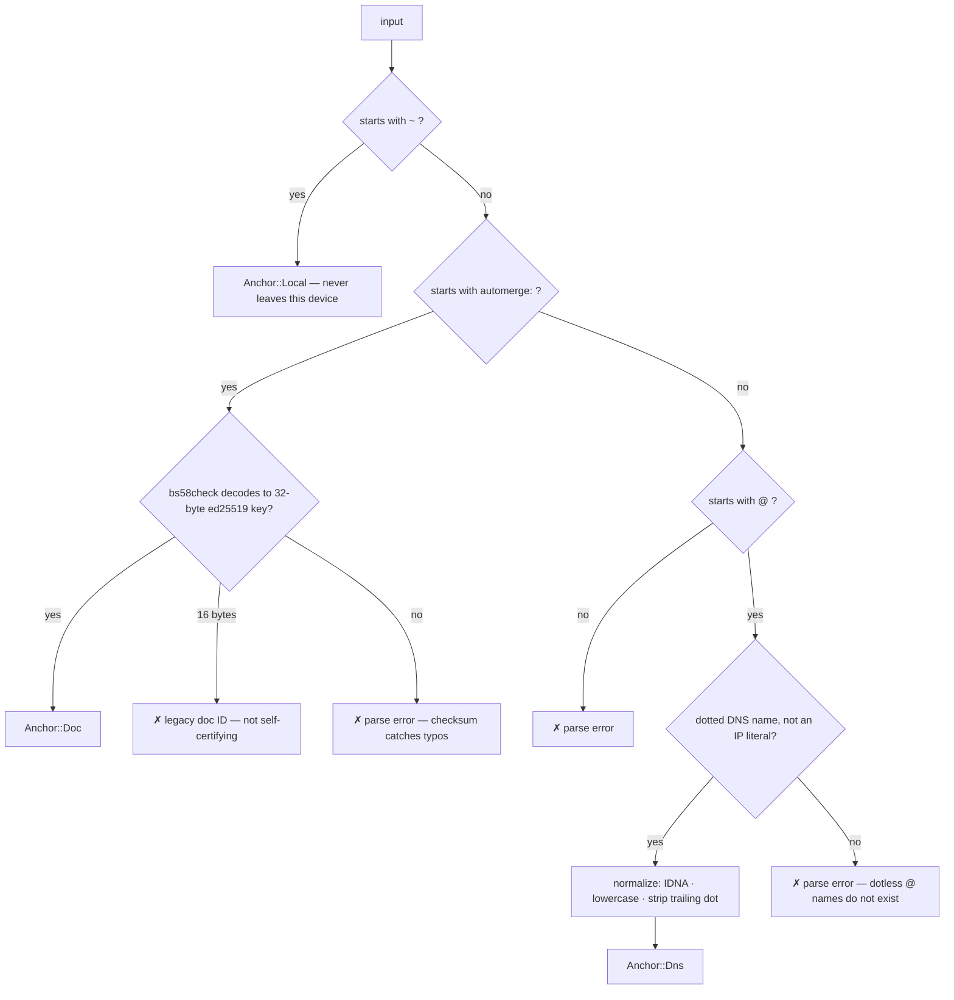

# Name Grammar

Onomancy names are _edgenames_: a trust anchor followed by path segments, where segments greedily match keys in a namestore and each matched key hops to another document ([path-resolution spec](../specs/path-resolution.md)). The anchor is decided _syntactically at parse time_ — parsing returns an `Anchor` enum, never a string to be interpreted later.

## The Three Anchors

| Spelling             | Anchor        | Authority             | Shareable |
|----------------------|---------------|-----------------------|-----------|
| `~/bob/pics`         | Self          | your signed root doc  | no        |
| `@expede.wtf/foo`    | DNS name      | DNSSEC chain from KSK | yes       |
| `automerge:2nBe…/foo`| Automerge doc | self-certifying       | yes       |

```
sigil
↓
~/bob/pics
 └───┬───┘
     path segments

sigil
↓
@expede.wtf/foo/bar
 └───┬────┘└──┬───┘
   anchor    path segments

automerge:2nBeEMDj…/blog#4NMNn…
└───┬────┘└───┬───┘└─┬─┘ └─┬──┘
 scheme     doc ID  path   heads (optional pin, `|`-joined)
```

## Parse Rules

Each spelling family is exactly one anchor kind; there is no fallback between families:



- _`@` means DNS and nothing else._ IDNA, lowercasing, and trailing-dot normalization apply. IP literals are rejected. Dotless `@` names are flat parse errors — the `@bob` vs `@bob.co` near-miss phishing class is deleted, not mitigated.
- _Internationalized names normalize to A-labels._ DNS itself is ASCII on the wire: Unicode names (U-labels, e.g. `аррӏе.com`) are IDNA-encoded to Punycode A-labels (`xn--80ak6aa92e.com`). Onomancy parses, stores, compares, and validates **A-labels only** — the DNSSEC chain never sees Unicode. U-labels exist purely at the display layer, which is where homograph defenses live (see [security.md](./security.md#homographs-and-the-display-layer)).
- _Doc anchors are Automerge URLs_: `automerge:<bs58check-doc-id>[/segments][#head|head]`. The payload encoding is upstream automerge-repo's, not ours; the bs58check checksum makes transcription typos fail loudly instead of silently denoting a different valid key. Legacy 16-byte document IDs are rejected with a distinct error — they're valid Automerge URLs but not self-certifying, so they can't anchor a name.
- _Heads pin the anchor document_ to a point in time (`#`-suffixed, `|`-joined, matching automerge-repo). `#` is reserved in segments across every anchor family. Pinned names are stale-by-construction; freshness policy is resolution-layer.
- _Dotless DNS names are defined out of existence_, aligned with ICANN SAC053 (dotless domains are harmful and won't be delegated).
- `~` is local-only by construction and never hits the wire. The “no protocol info in shareable names” rule is narrowed to DNS anchors: DNS names are protocol-free indirection, while doc anchors are direct references and deliberately carry the `automerge:` scheme.

## Grammar Sketch

```abnf
name         = local-name / dns-name-ref / doc-name
local-name   = "~" *( "/" segment )
dns-name-ref = "@" dns-name *( "/" segment )
doc-name     = "automerge:" doc-id *( "/" segment ) [ "#" heads ]
dns-name     = label 1*( "." label )      ; ≥ one dot, post-normalization
doc-id       = bs58check-key              ; 32-byte ed25519 vk + checksum
heads        = head *( "|" head )         ; bs58check 32-byte change hashes
segment      = 1*segment-char             ; non-empty, no "/" "#", no "." ".."
```

> [!NOTE]
> This is a sketch; the normative grammar is the [name-grammar spec](../specs/name-grammar.md), which `onomancy_core::name` implements and the Lean conformance vectors check.

## The Parsed Type

```rust
pub enum Anchor {
    /// `~` — your signed root doc. Local-only; no wire encoding exists.
    Local,
    /// `@name.tld` — DNSSEC-attested, post-normalization.
    Dns(DnsName),
    /// `automerge:…` — the doc ID IS an ed25519 vk. Self-certifying.
    Doc(DocAnchor),
}

pub struct Name {
    anchor: Anchor,
    segments: Vec<Segment>, // each non-empty, validated at parse
    heads: Vec<Head>,       // doc anchors only; empty = live name
}
```

Parse-don't-validate: there is no "string name" type downstream of the parser. Every consumer receives an `Anchor` and can rely on its invariants (a `Dns` anchor is normalized and dotted; a `Doc` anchor is a structurally valid key).

## Doc-ID Encoding

Decided: upstream automerge-repo's own encoding — bs58check over the 32-byte ed25519 verifying key (the Keyhive root document ID). Onomancy defines no encoding of its own; algorithm agility is upstream's concern. The checksum doubles as transcription-typo detection: a corrupted multikey had roughly a coin-flip chance of decoding to some other valid curve point, while bs58check rejects at ~1/2³² false-accept.

Heads semantics are likewise upstream's: `#heads` pins the root document exactly as in automerge-repo URLs. Path semantics diverge deliberately: onomancy segments greedily match multi-segment keys in a **flat** namestore at a reserved location in the document ([path-resolution spec](../specs/path-resolution.md#namestore-layout)), whereas upstream URL paths descend nested sub-trees.

> [!WARNING]
> Open tension: an earlier draft claimed vanilla Automerge tools could resolve a name to the reference value by ordinary sub-tree descent. That claim broke when the namestore became a flat map with multi-segment keys — a vanilla tool descending `automerge:‹id›/foo/bar` will not find the flat key `"foo/bar"` at the reserved location. Either the vanilla-compatibility goal is dropped, or the namestore layout needs to reconcile with upstream path semantics. Track alongside the reserved-location coordination point with upstream.

## Hygiene Rules

| Rule | Rationale |
|------|-----------|
| Anchor-only names allowed (`@expede.wtf`, `automerge:2nBe…`) | Resolves to the root doc itself |
| `#` reserved in segments, all anchor families | Heads delimiter; no lookalike pinned names |
| Empty segments rejected (`@x.y//a`) | No silent normalization surprises |
| `.` and `..` segments rejected | No traversal semantics to exploit |
| DNS length limits (253 total / 63 per label) | Wire compatibility |
| Overall length budget | QR-code introduction capacity |
| Dots in segments/labels carry no meaning | Anchor discrimination is entirely by sigil/scheme; `~/bmann.ca` is a legal label with no verification connotation |
| NFC normalization + case policy for segments | Display consistency (see [security.md](./security.md#homographs-and-the-display-layer)) |

## Rejected Alternative: One Spelling, Precedence Rules

A single spelling with a precedence rule ("local wins" or "DNS wins") was considered and rejected:

- Ambiguous anchors are where phishing lives — a name whose meaning depends on lookup order is an attack surface, not a convenience.
- Meaning could shift with connectivity (offline: petname; online: DNS) or with domain registration — a TOCTOU race on the trust anchor itself.

Syntactic discrimination makes the anchor a parse-time fact, independent of network state.

## Formal Verification Targets

The grammar is the sweet spot for machine-checked proofs. Per ADR-015 the Lean model is developed alongside the Rust implementation (which lands first, with bolero properties); targets:

1. _Anchor disjointness_ — no string parses as more than one anchor class (the anti-phishing theorem)
2. _Roundtrip_ — `parse (print n) = some n`; `print` is injective
3. _Normalization idempotence_ — `norm (norm x) = norm x`
