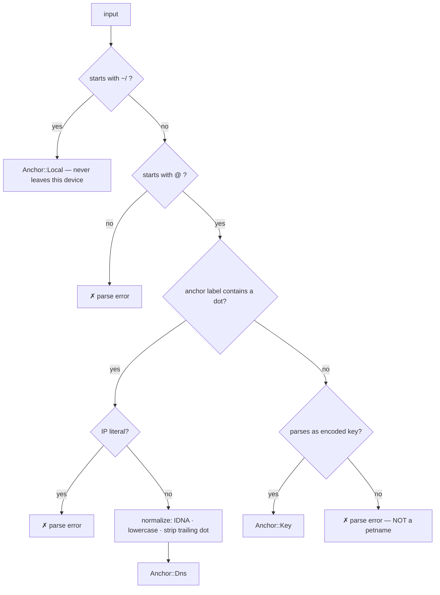

# Name Grammar

Onomancer names are _edgenames_: a trust anchor followed by path segments, where each segment is an edge in a document and each hop lands in another document. The anchor is decided _syntactically at parse time_ — parsing returns an `Anchor` enum, never a string to be interpreted later.

## The Three Anchors

| Spelling | Anchor | Authority | Shareable |
|--------------------|---------------|------------------------|-----------|
| `~/bob/pics` | Self | your signed root doc | no |
| `@expede.wtf/foo` | DNS name | DNSSEC chain from KSK | yes |
| `@z6MkhaXg…/foo` | Key (doc ID) | self-certifying | yes |

```
~/bob/pics
└┬┘└───┬──┘
sigil  segments

@expede.wtf/foo/bar
│└────┬───┘└───┬──┘
│   anchor   segments
sigil (the only sigil that hits the wire)
```

## Parse Rules

The discriminator under `@` is the presence of dots:



- _Dots ⇒ DNS name._ IDNA, lowercasing, and trailing-dot normalization apply. IP literals are rejected.
- _Internationalized names normalize to A-labels._ DNS itself is ASCII on the wire: Unicode names (U-labels, e.g. `аррӏе.com`) are IDNA-encoded to Punycode A-labels (`xn--80ak6aa92e.com`). Onomancer parses, stores, compares, and validates **A-labels only** — the DNSSEC chain never sees Unicode. U-labels exist purely at the display layer, which is where homograph defenses live (see [security.md](./security.md#homographs-and-the-display-layer)).
- _Dotless ⇒ must parse as a valid encoded key_, else the whole name is a parse error. Petnames **never** appear under `@` — this kills the `@bob` vs `@bob.co` near-miss phishing class.
- _Dotless DNS names are defined out of existence_, aligned with ICANN SAC053 (dotless domains are harmful and won't be delegated).
- `~` is local-only by construction and never hits the wire, so it doesn't violate the "no sigils other than `@` in shareable names" rule.

## Grammar Sketch

```abnf
name         = local-name / shared-name
local-name   = "~" *( "/" segment )
shared-name  = "@" anchor *( "/" segment )
anchor       = dns-name / encoded-key
dns-name     = label 1*( "." label )      ; ≥ one dot, post-normalization
encoded-key  = multibase-key              ; dotless, e.g. "z6Mk…"
segment      = 1*segment-char             ; non-empty, no "/", no "." ".."
```

> [!NOTE]
> This is a sketch, not the normative grammar. The implementation in `onomancer_core::name` is the source of truth once it lands (currently a placeholder).

## The Parsed Type

```rust
pub enum Anchor {
    /// `~` — your signed root doc. Local-only; no wire encoding exists.
    Local,
    /// `@name.tld` — DNSSEC-attested, post-normalization.
    Dns(DnsName),
    /// `@z6Mk…` — the key IS the root doc ID. Self-certifying.
    Key(VerifyingKey),
}

pub struct Name {
    anchor: Anchor,
    segments: Vec<Segment>, // each non-empty, validated at parse
}
```

Parse-don't-validate: there is no "string name" type downstream of the parser. Every consumer receives an `Anchor` and can rely on its invariants (a `Dns` anchor is normalized and dotted; a `Key` anchor is a structurally valid key).

## Key Encoding

A multibase/multikey-flavored encoding (`z6Mk…`, à la `did:key`) is favored: it self-describes the key type without smuggling protocol info into the name. Ed25519-only at v0. The exact choice is open (tracked in TODO).

## Hygiene Rules

| Rule | Rationale |
|------|-----------|
| Anchor-only names allowed (`@expede.wtf`) | Resolves to the root doc itself |
| Empty segments rejected (`@x.y//a`) | No silent normalization surprises |
| `.` and `..` segments rejected | No traversal semantics to exploit |
| DNS length limits (253 total / 63 per label) | Wire compatibility |
| Overall length budget | QR-code introduction capacity |
| Petname labels contain no dots | Preserves the dot discriminator |
| NFC normalization + case policy for segments | Display consistency (see [security.md](./security.md#homographs-and-the-display-layer)) |

## Rejected Alternative: One Spelling, Precedence Rules

A single spelling with a precedence rule ("local wins" or "DNS wins") was considered and rejected:

- Ambiguous anchors are where phishing lives — a name whose meaning depends on lookup order is an attack surface, not a convenience.
- Meaning could shift with connectivity (offline: petname; online: DNS) or with domain registration — a TOCTOU race on the trust anchor itself.

Syntactic discrimination makes the anchor a parse-time fact, independent of network state.

## Formal Verification Targets

The grammar is the sweet spot for machine-checked proofs (tracked in TODO):

1. _Anchor disjointness_ — no string parses as more than one anchor class (the anti-phishing theorem)
2. _Roundtrip_ — `parse (print n) = some n`; `print` is injective
3. _Normalization idempotence_ — `norm (norm x) = norm x`
