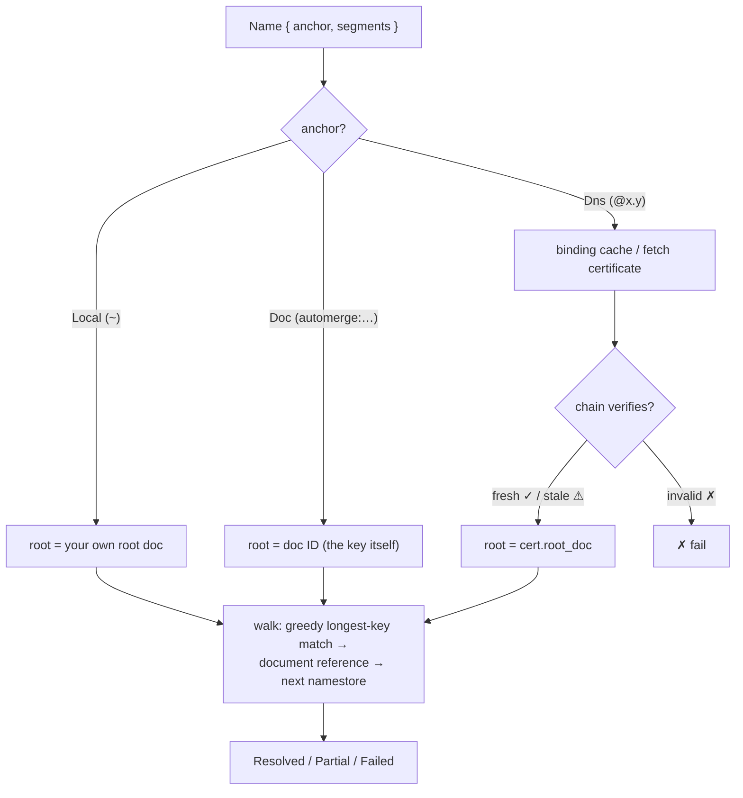

# Resolution

How a parsed name becomes a document: anchor → root namestore → greedy walk, one hop per matched key. Normative details live in the [path-resolution spec](../specs/path-resolution.md); this document covers the two local stores (petname store, binding cache) and the edge-case resolution semantics.

## The Two Stores

| | Petname store | Binding cache |
|---|---|---|
| Lives in | YOUR signed root doc | local cache, any storage |
| Contains | edges: label → bare document reference (Automerge URL) | self-authenticating certs (cert + DNSSEC chain) + unverified introduction claims |
| Authority | yes — signed by you | **none** — chain re-verified at use |
| Keyed by | petname label | hostname |
| Shareable | no (local-only) | yes (record-first gossip) |

### Petname Store

Edges in your root namestore are _bare self-certifying document references_ (the source of truth — the document ID is an ed25519 verifying key), nothing more. Local rename/edit is free — trust never flows through the label. Labels default from the alleged name at introduction (`@bmann.ca` → suggested `~/bmann.ca`), but the alleged name itself is recorded in the binding cache as an unverified claim, never on the edge: a composite `{target, met_as}` record would merge field-wise (torn states) and replicate introduction provenance to every sync peer.

_Divergence_ — a hostname's binding (verified or claimed) attests a new key while a pin still holds the old one — is detected by joining the binding cache against pinned targets, and surfaces with a re-pin flow: SSH `known_hosts` semantics, not silent acceptance and not hard failure.

### Binding Cache

Entries are self-authenticating certificates with graded freshness (`Verified { verified_at, chain_window }`). The user's decisions — acceptances, resets, and the _claims_ recording what hostnames were alleged at introductions (the divergence tripwire's memory, graded below stale) — live beside it in a user-private **decision document**: a Keyhive doc delegated to exactly your devices, so decisions follow the person (E2EE, CRDT-merged, editable) while never reaching sync peers. Presence in the cache confers no authority; the chain is re-verified against the baked-in KSK at use. The cache is a grow-only _store_ (records from anyone) beside the decision document (decisions from you), and every verifier conclusion — accepted binding, effective serial, tenure, pending badges — is a deterministic derivation over it: `derive(store, now, decisions)`. Sync is plain set union, and arrival order is never an input, so gossip races decide nothing: a stale record attesting a different document derives as _pending_ (badge, no prompt) until fresh evidence or a succession proof connects it, and ambiguous first contact surfaces as _contested_ instead of rewarding whoever gossiped first. Semantics live in the [binding-cache spec](../specs/anchoring/binding-cache.md) — and none of it requires connectivity, because freshness is a property of the record (fresh chains travel by gossip), not of the network. See [anchors.md](./anchors.md#consequence-1-dns-bindings-are-not-edges-in-your-root-doc) for why bindings are _not_ petname edges.

## Resolution Algorithm



Each hop: greedily match the longest namestore key against the remaining segments, obtain a _document reference_ (the doc ID is a verifying key), load that document's namestore, continue — see the [path-resolution spec](../specs/path-resolution.md#resolution) for the normative rules (no backtracking, conflict handling, non-conforming keys).

## Termination

Because edges hold document references and never names, each hop consumes at least one segment, and resolution terminates in at most `len(segments)` hops.

Cycles are semantically fine and structurally harmless: in `@me/alice/bob/alice`, the two `alice` edges live in _different_ documents; the walk still consumes a segment per hop.

> [!IMPORTANT]
> Design invariant: **no symlink-style edges.** An edge must never contain a name that gets re-resolved — that is the only thing that could reintroduce non-termination. This invariant is a formal-verification target.

## Partial Results

Resolution output is richer than hit/miss:

```rust
pub enum Resolution {
    Resolved(Document),
    /// Walked some prefix; the rest is unavailable, not wrong.
    Partial {
        resolved_prefix: Vec<Segment>,
        reason: PartialReason, // dangling segment · unsynced target doc
    },
    Failed(ResolveError),
}
```

CRDT conflicts on edges (two concurrent writes to the same label) are resolved by a deterministic pick _plus_ conflict visibility — the loser is surfaced, never silently dropped.

## Which Record Wins Offline

When two artifacts for the same name meet (cache vs gossip, both possibly stale), precedence runs down a vouching hierarchy — each rung only consulted when the stronger is silent:

| Rung | Comparator | Vouched by |
|------|-----------|------------|
| 0 | Chain freshness (fresh ✓ beats stale ⚠) | DNSSEC windows |
| 1 | Succession proofs / generation lineage descent | The document's own keys |
| 2 | Zone-state key `(window_end, serial, issued_at)`, lexicographic — one sort key per record, so the order is total and cannot cycle | DNSSEC windows, then the zone, then the signer |

Rung 2 orders zone states across documents for the same hostname — which is _current_ — but only a successor proof confers _continuity_, and ordering alone never _moves_ an incumbent accepted binding: displacement additionally needs fresh evidence, a proof, or a user acceptance (a stale later-window record proves the zone moved during a past window, not that its word is current); incumbency itself is decision-backed — acceptance-on-use records what you relied on in the decision document, so it is derivable rather than remembered by a device. An unproven cross-document winner is still a surfaced binding change. The residue that cannot be ordered is genuine zone equivocation (fully equal keys, different documents): contested, surfaced. Normative detail: [the dns-anchor spec](../specs/anchoring/dns-anchor.md#comparing-records-offline).

## Freshness Policy at Resolution Time

| Chain verdict | Online client | Offline client |
|---------------|---------------|----------------|
| fresh ✓ | proceed | proceed |
| stale ⚠ | re-fetch, then proceed | warn and proceed |
| invalid ✗ | fail | fail |

Staleness is a risk signal, not a forgery signal — the binding was provably DNS-rooted during its window ([dns-binding.md](./dns-binding.md#graded-freshness)). It is also a _state_, not an event: badge it, don't prompt for it — offline meshes live in stale ⚠ as their steady state, and the prompt budget belongs to real events ([security.md](./security.md#staleness-saturation)).

## Offline Fallback and Upgrade

Fully-offline introductions (QR code, verbal exchange) root as petnames in your own namespace immediately:

```
meet Bob offline:      ~/bob            (petname edge → Bob's key)
cert gossip arrives:   @bob.example/…   (same key, now chain-rooted)
```

The upgrade adds a spelling; it never migrates identity ([anchors.md](./anchors.md#consequence-4-no-identity-migration)).
