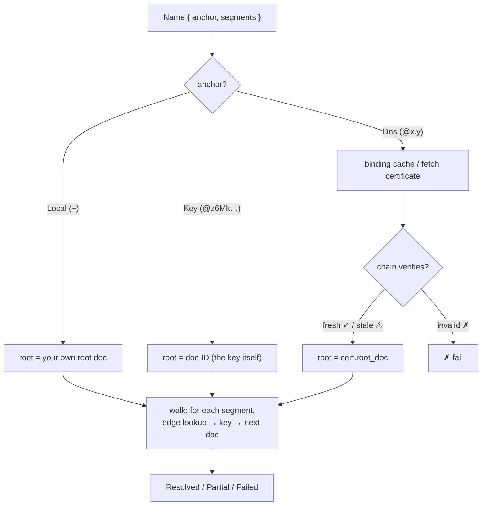

# Resolution

How a parsed name becomes a document: anchor → root doc → walk one edge per segment. This document also covers the two local stores (petname store, binding cache) and the edge-case semantics from ADR-011.

## The Two Stores

| | Petname store | Binding cache |
|---|---|---|
| Lives in | YOUR signed root doc | local cache, any storage |
| Contains | edges: label → verifying key + met-as metadata | self-authenticating certs (cert + DNSSEC chain) |
| Authority | yes — signed by you | **none** — chain re-verified at use |
| Keyed by | petname label | hostname |
| Shareable | no (local-only) | yes (record-first gossip) |

### Petname Store

Edges in your root document hold _verifying keys_ (the source of truth) plus the met-as name kept as metadata for humans and change detection. Local rename/edit is free — trust never flows through the label.

_Divergence_ — the met-as name attests a new key, or a pinned key no longer matches — is a surfaced event with a re-pin flow: SSH `known_hosts` semantics, not silent acceptance and not hard failure.

### Binding Cache

Entries are self-authenticating certificates with graded freshness (`Verified { verified_at, chain_window }`). Presence in the cache confers no authority; the chain is re-verified against the baked-in KSK at use. See [anchors.md](./anchors.md#consequence-1-dns-bindings-are-not-edges-in-your-root-doc) for why bindings are _not_ petname edges.

## Resolution Algorithm



Each hop: look up the segment label among the current document's edges, obtain a _verifying key_ (= next doc ID), load that document, continue.

## Termination

Because edges hold keys and never names, resolution consumes exactly one segment per hop and terminates in `len(segments)` steps.

Cycles are semantically fine and structurally harmless: in `@me/alice/bob/alice`, the two `alice` edges live in _different_ documents; the walk still consumes a segment per hop.

> [!IMPORTANT]
> Design invariant: **no symlink-style edges.** An edge must never contain a name that gets re-resolved — that is the only thing that could reintroduce non-termination. This invariant is a formal-verification target (tracked in TODO).

## Partial Results

Resolution output is richer than hit/miss:

```rust
pub enum Resolution {
    Resolved(Document),
    /// Walked some prefix; the rest is unavailable, not wrong.
    Partial {
        resolved_prefix: Vec<Segment>,
        reason: PartialReason, // dangling segment · unsynced target doc
    },
    Failed(ResolveError),
}
```

CRDT conflicts on edges (two concurrent writes to the same label) are resolved by a deterministic pick _plus_ conflict visibility — the loser is surfaced, never silently dropped.

## Freshness Policy at Resolution Time

| Chain verdict | Online client | Offline client |
|---------------|---------------|----------------|
| fresh ✓ | proceed | proceed |
| stale ⚠ | re-fetch, then proceed | warn and proceed |
| invalid ✗ | fail | fail |

Staleness is a risk signal, not a forgery signal — the binding was provably DNS-rooted during its window ([dns-binding.md](./dns-binding.md#graded-freshness)).

## Offline Fallback and Upgrade

Fully-offline introductions (QR code, verbal exchange) root as petnames in your own namespace immediately:

```
meet Bob offline:      ~/bob            (petname edge → Bob's key)
cert gossip arrives:   @bob.example/…   (same key, now chain-rooted)
```

The upgrade adds a spelling; it never migrates identity ([anchors.md](./anchors.md#consequence-4-no-identity-migration)).
